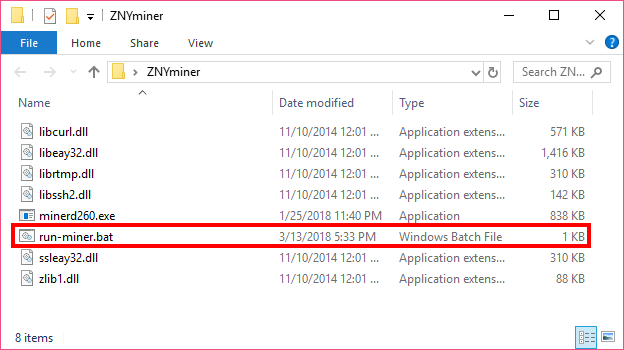

실행 스크립트의 다운로드가 완료되면 실행 스크립트 파일이 다음과 같이 위치해야합니다.

## 실행하기

``run-miner.bat`` 파일을 실행하여 아래의 빨간 사각형 안의 메세지들이 나오는지 체크하시기 바랍니다.

다음과 같은 메세지가 뜨지 않고 마이닝이 진행되지 않는다면 마이닝 풀의 주소 혹은 워커 ID/워커 PW의 일치를 확인하시고 다시 설정을 진행해보시기 바랍니다.